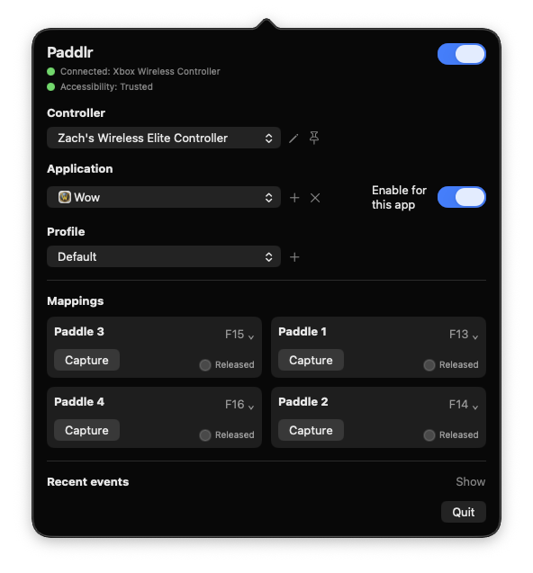
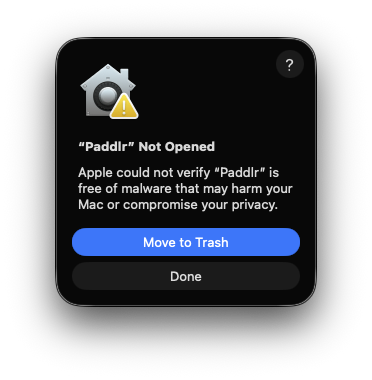
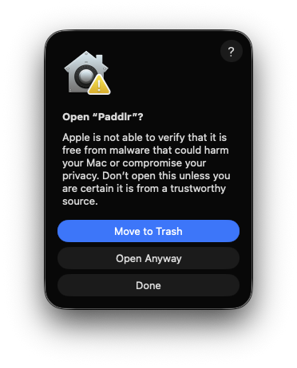
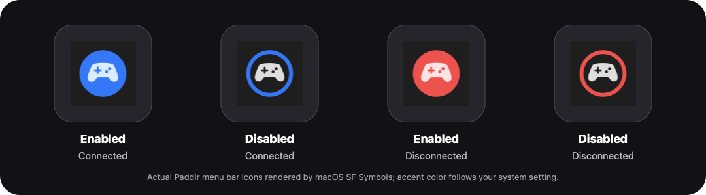

# Paddlr

<p align="center">
  
</p>

Paddlr is a lightweight macOS menu bar companion for using the four back paddles on an Xbox Elite Series 2 controller as distinct keyboard shortcuts.

macOS already includes native controller profiles for rebinding the standard Xbox buttons. Paddlr is intended to complement that built-in support by focusing on the Elite back paddles and mapping them to keyboard output.

It is currently focused on safe keyboard output: each paddle can send a configurable key such as F13-F16, arrows, letters, numbers, or modifiers.

## Screenshot



## Current status

- Primary target: macOS 26 Tahoe
- Minimum macOS version: macOS 15
- Tested hardware: Apple silicon Macs only so far; Intel Macs are not yet validated
- Primary app: `Paddlr`
- Output today: keyboard events through macOS Accessibility permission
- Default mappings:
  - Paddle 1 -> F13
  - Paddle 2 -> F14
  - Paddle 3 -> F15
  - Paddle 4 -> F16

## Quick start

### 1. Download and open Paddlr

Download the latest `Paddlr-<version>.zip` from [Releases](https://github.com/zachspartofaday/paddlr/releases). It contains `Paddlr.app` for users who do not want to build from source.

The app bundle is locally signed so macOS can validate its contents, but it is not Apple-notarized. macOS will likely show a warning such as “Paddlr.app can’t be opened because Apple cannot check it for malicious software” or may offer to move it to Trash.

If you trust the release source, this first-launch flow is expected:

1. Unzip the archive and move `Paddlr.app` to Applications if desired.
2. Try opening `Paddlr.app`.
3. macOS will likely show **“Paddlr” Not Opened** with **Move to Trash** and **Done**. Click **Done** first. Do not choose **Move to Trash**.

   <p align="center">
     
   </p>

4. Open **System Settings -> Privacy & Security**, scroll to **Security**, and click **Open Anyway** for Paddlr.
5. macOS will ask for confirmation with **Open Anyway** available. Click **Open Anyway**.

   <p align="center">
     
   </p>

6. You can also try right-click/control-click -> **Open** on `Paddlr.app`, but the Privacy & Security **Open Anyway** path is usually required for this preview build.

### 2. Grant macOS permissions

Paddlr may need two macOS permission capabilities:

- **Accessibility** for keyboard output.
- **Controller Input Access** for reading raw controller/HID input.

```text
System Settings -> Privacy & Security -> Accessibility
System Settings -> Privacy & Security -> Input Monitoring
```

If you launch `Paddlr.app`, grant permissions to Paddlr itself. If you run with `swift run`, grant permissions to Terminal or the `swift` host. Gatekeeper approval and runtime permissions are separate steps.

Move `Paddlr.app` to its final location, such as Applications, before granting permissions. If you grant permission first and then move the app, it should usually keep working, but macOS may ask again.

When the menu bar panel says **Accessibility: Permission Needed**, click **Grant Accessibility Permission** in Paddlr, then approve Paddlr in System Settings. Keyboard output will not work until Accessibility permission is granted.

When the menu bar panel says **Controller Input Access: Permission Needed**, click **Grant Controller Input Access** in Paddlr, then approve Paddlr if macOS opens a permission prompt or System Settings. The button requests macOS Input Monitoring/listen-event access and raw HID access; macOS still decides whether to show a prompt or add a separate Input Monitoring entry. Paddlr waits to start controller detection until controller input access is ready, so paddle input will not be detected before this step.

After pressing either permission button and returning to Paddlr, the app may prompt you to restart. Permission changes often apply more reliably after quitting and reopening the app.

On some Macs, granting Accessibility also satisfies Paddlr's controller input access check. In that case the panel may show **Controller Input Access: Ready** even if Paddlr does not appear in the Input Monitoring allow list.

When updating from an earlier preview build, macOS may ask for permissions again. If Paddlr still appears untrusted after an update or move, remove the old Paddlr entry from Accessibility/Input Monitoring, add the current `Paddlr.app` from its final location, and enable it.

### 3. Set the controller to Profile 0

For distinct paddle input, set the Xbox Elite Series 2 controller to **Profile 0** before using Paddlr. Profile 0 is the default/no-profile-LED mode.

Profiles 1-3 can also emit the controller's firmware-mapped buttons, which may cause games to see both the native controller input and Paddlr's keyboard output.

### 4. Configure mappings

After Paddlr launches, it appears as an icon in the macOS menu bar. Click the icon to open the mapping panel, then choose your controller, application scope, profile, and paddle mappings.

## Configuring Paddlr from the menu bar UI

Open the menu bar panel to configure controller, application, profile, and paddle mappings:

1. **Check status at the top of the panel.**
   - The controller row is green when an Elite paddle device is connected, orange when a controller is detected without usable Elite paddle input, and red when no Elite device is found.
   - Use the retry button next to the controller row if detection needs to be refreshed.
   - The Accessibility row is green when macOS trusts the launcher for keyboard output. If it says **Accessibility: Permission Needed**, click **Grant Accessibility Permission** or grant permission in System Settings.
   - The Controller Input Access row is green when macOS lets Paddlr read raw controller input. If it says **Controller Input Access: Permission Needed**, click **Grant Controller Input Access** or grant permission in System Settings. Paddlr will not start controller detection until this access is ready, and it may ask you to restart after returning to the app.
2. **Use the Keyboard output switch** in the top-right to turn all paddle output on or off without changing mappings.
3. **Choose a controller** in the Controller section when more than one controller is visible.
   - Use the pencil button to give a controller a friendly name.
   - Use the pin button to keep a named controller in the list while disconnected.
4. **Choose the application scope** in the Application section.
   - **Default** applies when there is no app-specific rule.
   - The current frontmost app appears automatically when Paddlr can identify it.
   - Paddlr keeps **Default**, pinned apps, saved-rule apps, and the three most recently detected apps in the selector.
   - Use the pin button beside **+** to keep the selected app in the list even when it uses the default profile; pinned apps show an **x** button so you can unpin them later.
   - Use **+** to add and pin another `.app` bundle manually; it will show the same **x** control until unpinned.
   - Toggle **Enable for this app** off to disable paddle output only for the selected app.
5. **Choose or create a profile** in the Profile section.
   - Selecting a profile saves it immediately for the selected app and selected controller. If **Default** is selected in the Application section, the profile becomes that controller's default mapping; with no controller selected, it becomes the global default mapping.
   - Use **+** to create a profile, the pencil to rename it, and **x** to delete a non-default profile.
   - Use the reset button on the default profile to restore P1-P4 to F13-F16.
6. **Edit paddle mappings** in the Mappings section.
   - Use each paddle's dropdown to choose a preset key or disable that paddle.
   - Use **Capture** to press a key and assign it to that paddle.
   - Changed paddle tiles are highlighted until you click **Save** for the selected app/default/controller target.
7. **Use Recent events** for troubleshooting. Click **Show** to see connection, permission, app-rule, and paddle-event messages.

## Menu bar icon states

Paddlr combines output state and controller status in one menu bar icon:



The examples above are enlarged captures. The actual icon is rendered by macOS from SF Symbols, and the accent color follows your system setting.

- **Filled** means paddle keyboard output is enabled for the current app.
- **Outlined** means output is disabled for the current app.
- **Accent color** means a supported Elite paddle controller is connected.
- **Red** means Paddlr does not currently see a supported paddle controller.

Click the icon to open or close the mapping panel. Right-click or Control-click it to show **Quit Paddlr**.

## Build and package from source

Build and run the self-test:

```bash
swift build
swift run PaddlrSelfTest
```

Run the menu bar app directly from SwiftPM:

```bash
swift run Paddlr
```

Create the same convenience app bundle locally:

```bash
scripts/release/package_app.sh --clean --create-zip
open dist/Paddlr.app
```

The packaging script creates `dist/Paddlr.app` and, when requested, a zipped release archive. It embeds the Paddlr app icon, applies local bundle signing for macOS validation, and never changes repository visibility.

## Diagnostics

Diagnostic helper labels are hidden by default. To show extra output/profile helper text while validating behavior, launch with either:

```bash
PADDLR_DIAGNOSTIC_UI=1 swift run Paddlr
swift run Paddlr -- --diagnostic-ui
```

Live console logging is also off by default. Enable it with:

```bash
PADDLR_DEBUG_LOG=1 swift run Paddlr
```

Additional command-line tools are included for troubleshooting:

```bash
swift run PaddlrDetect
swift run PaddlrDiagnostics
swift run PaddlrHIDProbe
swift run PaddlrRawReportProbe
```

## Known issues and planned features

- **Xbox/gamepad button output is planned.** Paddlr currently sends keyboard output, not virtual gamepad buttons such as A/B/X/Y. For standard Xbox button rebinding, use macOS's native controller profiles.
- **USB wired Elite 2 support needs more work.** Bluetooth paddle input works through the currently validated path; a lower-level USB backend is still under investigation.
- **More controller variants need validation.** Additional Elite controller models, firmware versions, connection modes, and Intel Macs should be tested before broad compatibility claims.
- **Left/right modifier-specific mappings are planned.** Current modifier mappings are generic Shift/Control/Option/Command rather than side-specific variants.

See [Compatibility Notes](COMPATIBILITY.md) for current hardware, controller-profile, and game-specific notes.

## Limitations

- Paddlr does not suppress native controller input. It adds keyboard output when paddle input is detected.
- Games that listen directly to controller input may still see the controller's own signals.
- Games that dynamically switch visible input glyphs may alternate between keyboard and Xbox button prompts when paddles mapped to keyboard keys are pressed. Known examples are tracked in [Compatibility Notes](COMPATIBILITY.md).
- Xbox Wireless Adapter support is not expected on macOS.

## License

MIT License. See [LICENSE](LICENSE).
