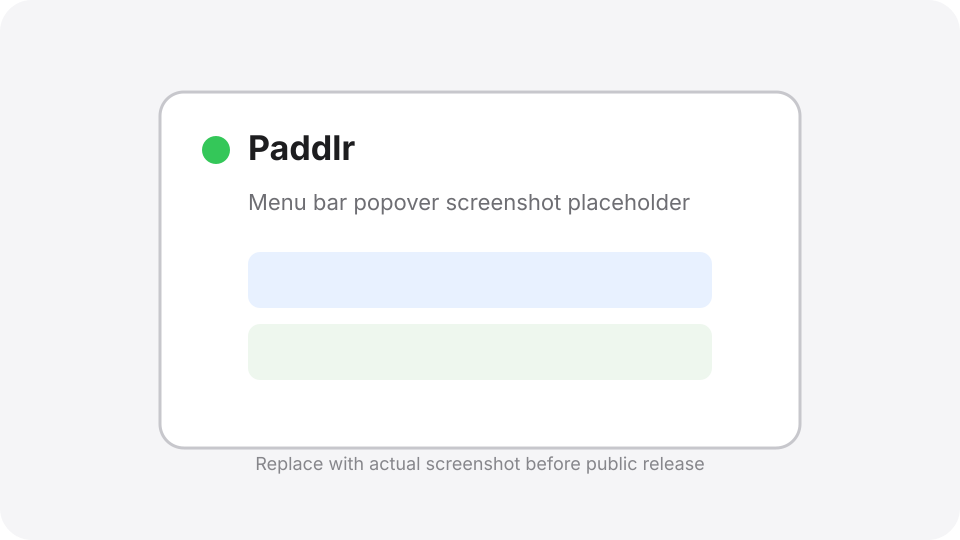
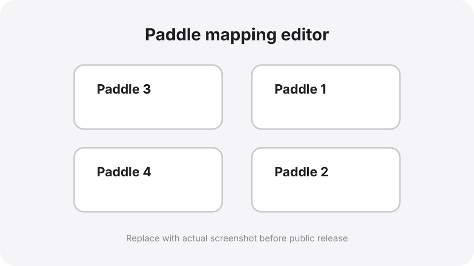
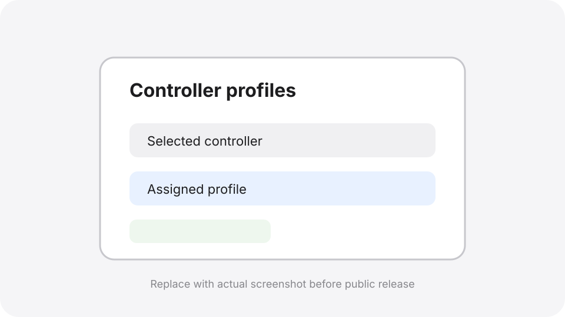

# Paddlr

Paddlr is a lightweight macOS menu bar companion for using the four back paddles on an Xbox Elite Series 2 controller as distinct keyboard shortcuts.

macOS already includes native controller profiles for rebinding the standard Xbox buttons. Paddlr is intended to complement that built-in support by focusing on the Elite back paddles and mapping them to keyboard output.

It is currently focused on safe keyboard output: each paddle can send a configurable key such as F13-F16, arrows, letters, numbers, or modifiers.

## Screenshots

> Screenshots will be added before the public release.







## Current status

- Primary target: macOS 26 Tahoe
- Minimum macOS version: macOS 15
- Tested hardware: Apple silicon Macs only so far; Intel Macs are not yet validated
- Primary app: `Paddlr`
- Output today: keyboard events through macOS Accessibility permission
- Default mappings:
  - Paddle 1 -> F13
  - Paddle 2 -> F14
  - Paddle 3 -> F15
  - Paddle 4 -> F16

## Build and run

Build and run the self-test:

```bash
swift build
swift run PaddlrSelfTest
```

Run the menu bar app:

```bash
swift run Paddlr
```

The app appears as an icon in the macOS menu bar. Click the icon to open the mapping panel.

## Menu bar icon states

Paddlr's menu bar icon shows two pieces of status at once:

| Icon state | Meaning |
| --- | --- |
| Filled controller circle | Paddle keyboard output is enabled for the current application. |
| Outline controller circle | Paddle keyboard output is disabled for the current application. This can happen when the global keyboard-output switch is off, the default application rule is disabled, or the current app has its own disabled rule. |
| Accent-colored status mark | A supported Xbox Elite paddle device is connected and available. |
| Red status mark | No supported Elite paddle device is currently connected, or Paddlr is still waiting for one. |

Common combinations:

- **Filled + accent color:** ready; paddles should emit the configured keyboard output.
- **Outline + accent color:** controller is connected, but output is disabled for the active app.
- **Filled + red:** mappings are enabled, but Paddlr does not currently see a supported paddle device.
- **Outline + red:** output is disabled and no supported paddle device is connected.

Click the icon to open or close the mapping panel. Right-click or Control-click it to show the small status menu with **Quit Paddlr**.

## Configuring Paddlr from the menu bar UI

Open the menu bar panel to configure controller, application, profile, and paddle mappings:

1. **Check status at the top of the panel.**
   - The controller row is green when an Elite paddle device is connected, orange when a controller is detected without usable Elite paddle input, and red when no Elite device is found.
   - Use the retry button next to the controller row if detection needs to be refreshed.
   - The Accessibility row is green when macOS trusts the launcher for keyboard output. If it says **Accessibility: Needed**, use **Prompt** or grant permission in System Settings.
2. **Use the Keyboard output switch** in the top-right to turn all paddle output on or off without changing mappings.
3. **Choose a controller** in the Controller section when more than one controller is visible.
   - Use the pencil button to give a controller a friendly name.
   - Use the pin button to keep a named controller in the list while disconnected.
4. **Choose the application scope** in the Application section.
   - **Default** applies when there is no app-specific rule.
   - The current frontmost app appears automatically when Paddlr can identify it.
   - Paddlr keeps **Default**, pinned apps, saved-rule apps, and the three most recently detected apps in the selector.
   - Use the pin button beside **+** to keep the selected app in the list even when it uses the default profile; pinned apps show an **x** button so you can unpin them later.
   - Use **+** to add and pin another `.app` bundle manually; it will show the same **x** control until unpinned.
   - Toggle **Enable for this app** off to disable paddle output only for the selected app.
5. **Choose or create a profile** in the Profile section.
   - Selecting a profile saves it immediately for the selected app and selected controller. If **Default** is selected in the Application section, the profile becomes the default app mapping.
   - Use **+** to create a profile, the pencil to rename it, and **x** to delete a non-default profile.
   - Use the reset button on the default profile to restore P1-P4 to F13-F16.
6. **Edit paddle mappings** in the Mappings section.
   - Use each paddle's dropdown to choose a preset key or disable that paddle.
   - Use **Capture** to press a key and assign it to that paddle.
   - Changed paddle tiles are highlighted until you click **Save** for the selected app/default/controller target.
7. **Use Recent events** for troubleshooting. Click **Show** to see connection, permission, app-rule, and paddle-event messages.

## Controller setup

For distinct paddle input, set the Xbox Elite Series 2 controller to **Profile 0** before using Paddlr. Profile 0 is the default/no-profile-LED mode. Profiles 1-3 can also emit the controller's firmware-mapped buttons, which may cause games to see both the native controller input and Paddlr's keyboard output.

## Permissions

Paddlr uses CoreGraphics keyboard events for output. macOS may require Accessibility permission for the terminal or host app that launches it:

```text
System Settings -> Privacy & Security -> Accessibility
```

If the app launches from Terminal, grant Accessibility permission to Terminal or the `swift` host.

## Diagnostics

Diagnostic helper labels are hidden by default. To show extra output/profile helper text while validating behavior, launch with either:

```bash
PADDLR_DIAGNOSTIC_UI=1 swift run Paddlr
swift run Paddlr -- --diagnostic-ui
```

Live console logging is also off by default. Enable it with:

```bash
PADDLR_DEBUG_LOG=1 swift run Paddlr
```

Additional command-line tools are included for troubleshooting:

```bash
swift run PaddlrDetect
swift run PaddlrDiagnostics
swift run PaddlrHIDProbe
swift run PaddlrRawReportProbe
```

## Known issues and planned features

- **Xbox/gamepad button output is planned.** Paddlr currently sends keyboard output, not virtual gamepad buttons such as A/B/X/Y. For standard Xbox button rebinding, use macOS's native controller profiles.
- **USB wired Elite 2 support needs more work.** Bluetooth paddle input works through the currently validated path; a lower-level USB backend is still under investigation.
- **More controller variants need validation.** Additional Elite controller models, firmware versions, connection modes, and Intel Macs should be tested before broad compatibility claims.
- **Left/right modifier-specific mappings are planned.** Current modifier mappings are generic Shift/Control/Option/Command rather than side-specific variants.

See [Compatibility Notes](COMPATIBILITY.md) for current hardware, controller-profile, and game-specific notes.

## Limitations

- Paddlr does not suppress native controller input. It adds keyboard output when paddle input is detected.
- Games that listen directly to controller input may still see the controller's own signals.
- Games that dynamically switch visible input glyphs may alternate between keyboard and Xbox button prompts when paddles mapped to keyboard keys are pressed. Known examples are tracked in [Compatibility Notes](COMPATIBILITY.md).
- Xbox Wireless Adapter support is not expected on macOS.
- App bundle packaging/signing/notarization is not included yet.

## License

MIT License. See [LICENSE](LICENSE).
